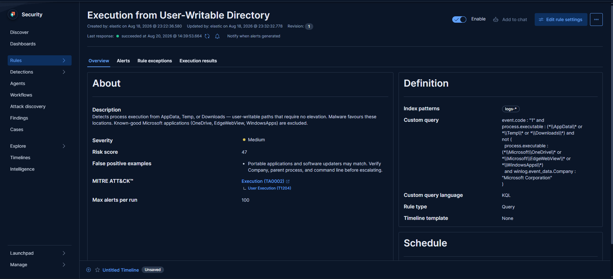
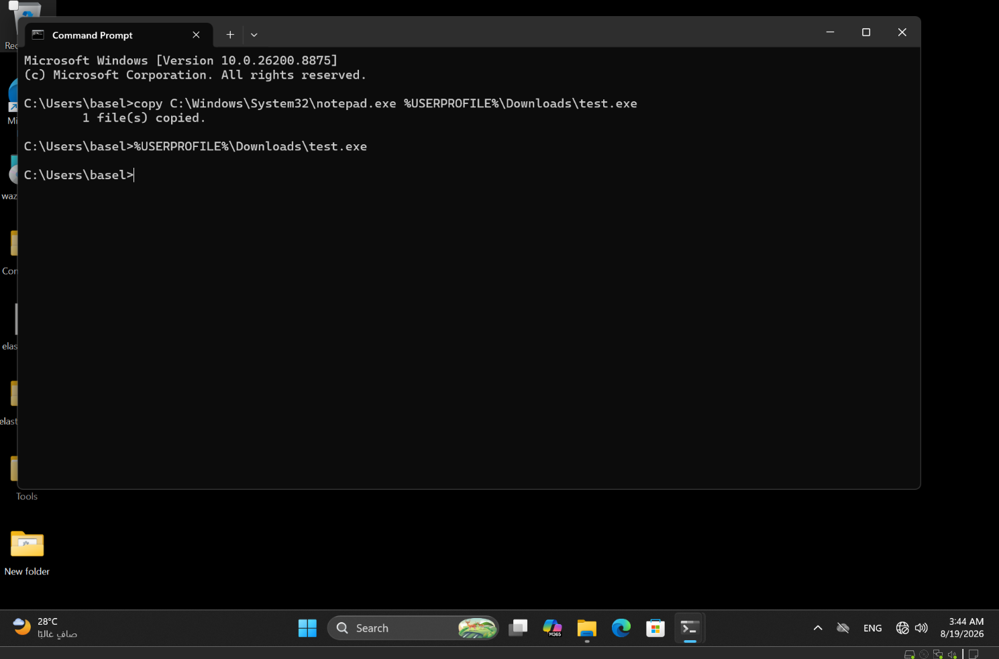
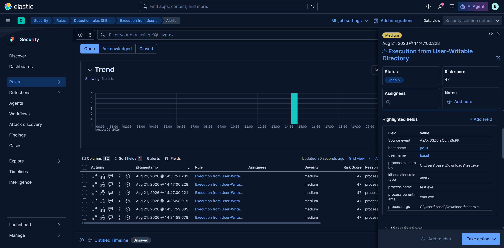
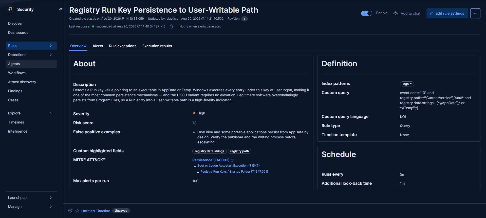
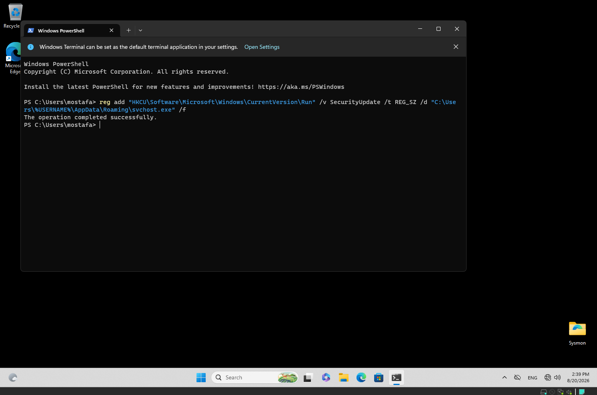
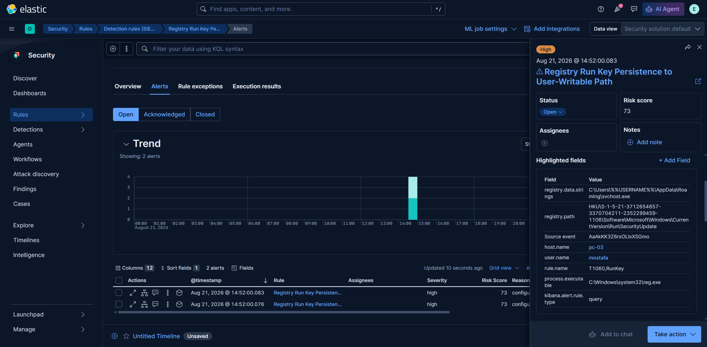

# Detection Rules

Elastic SIEM detection rules developed and validated in a home SOC lab.

Every rule here has been tested against real telemetry — the trigger 
was reproduced deliberately and the alert confirmed to fire.

## Environment

| Component | Detail |
|-----------|--------|
| SIEM | Elasticsearch + Kibana 9.5 |
| Collection | Elastic Agent (Fleet-managed) |
| Endpoint telemetry | Sysmon (SwiftOnSecurity config) |
| Endpoints | Windows 11 clients, Windows Server 2022 DC/ADC |

## Rules

| # | Rule | MITRE | Severity | Status |
|---|------|-------|----------|--------|
| 1 | Execution from User-Writable Directory | T1204 | Medium | ✅ Validated |
| 2 | Registry Run Key Persistence to User-Writable Path | T1547.001 | High | ✅ Validated |

---

## Rule 1 — Execution from User-Writable Directory

**MITRE:** T1204 — User Execution
**Severity:** Medium (47)
**Interval:** 5m, look-back 1m
**Index:** `logs-*`

### Query
event.code : "1" and
process.executable : (\AppData\ or \Temp\ or \Downloads\) and
not (
process.executable : (\Microsoft\OneDrive\ or \Microsoft\EdgeWebView\ or \WindowsApps\)
and winlog.event_data.Company : "Microsoft Corporation"
)


### Rationale

Malware favours AppData, Temp and Downloads because these paths are 
writable without elevation and are frequently excluded from restrictive 
application-control policies.

### Tuning

The initial query returned three hits, all Microsoft OneDrive components. 
OneDrive installs into AppData by design, so these are expected. They were 
verified legitimate against two independent signals — publisher 
(`Microsoft Corporation`) and parent process (`explorer.exe` and 
`svchost.exe -k netsvcs -p -s Schedule`).

The exclusion requires **both** a known-good path **and** a matching 
publisher. Excluding on path alone would let a payload dropped into the 
OneDrive folder bypass the rule.

### Validation





`notepad.exe` was copied to `Downloads` as `test.exe` and executed. 
The alert fired within one rule interval.

One detail worth noting from the alert: `process.name` showed `test.exe` 
while `process.pe.original_file_name` retained `NOTEPAD.EXE`. The rename 
was visible in telemetry — the same signal that exposes malware 
masquerading under a system process name.

### Known false positives

Portable applications and software updaters may match. Verify publisher, 
parent process and command line before escalating.

---
---

## Rule 2 — Registry Run Key Persistence to User-Writable Path

**MITRE:** T1547.001 — Registry Run Keys / Startup Folder
**Severity:** High (73) | **Interval:** 5m, look-back 1m | **Index:** `logs-*`

### Query

```
event.code : "13" and
registry.path : *\\CurrentVersion\\Run\\* and
registry.data.strings : (*\\AppData\\* or *\\Temp\\*)
```

### Rationale

Windows executes every entry under the Run key at user logon. The HKCU 
variant requires no elevation, making it one of the cheapest persistence 
mechanisms available to an attacker holding only user-level access.

The rule targets a contradiction rather than the Run key alone: a Run 
entry means "execute at every logon, permanently", while AppData and Temp 
are user-scoped, non-elevated locations. Legitimate installers request 
elevation and place binaries in Program Files. An attacker without 
elevation has no such option.

### Field note

Sysmon logs the user hive as `HKU\<SID>`, not `HKCU`. `HKCU` is a 
per-session alias that does not exist at the kernel level where Sysmon 
operates — a rule matching the literal string `HKCU` would never fire. 
This query wildcards the `CurrentVersion\Run` portion, which appears in 
both representations.

### Validation





A Run value named `SecurityUpdate` was written from a non-elevated command 
prompt, pointing to `%APPDATA%\Roaming\svchost.exe`. The alert fired within 
one rule interval.

Two details confirmed the rule's premise: the write succeeded without any 
UAC prompt, and `process.executable` captured `reg.exe` as the writing 
process — the field that identifies which process established persistence 
during a real investigation.

### Observed in the wild

The XWormRAT sample analysed in this lab used exactly this pattern: 
`HKCU\...\Run\bin` → `%APPDATA%\Roaming\bin.exe`, with spoofed publisher 
metadata. That persistence was originally found by manual Autoruns 
inspection; this rule detects it automatically.

### Known false positives

OneDrive and some portable applications persist from AppData by design. 
Verify publisher and writing process before escalating.

## About

Cybersecurity undergraduate and SOC analyst candidate, currently in 
Blue Team incident response training.

**Basel Mostafa Ibrahim** · [LinkedIn](https://linkedin.com/in/baselmostafa)
